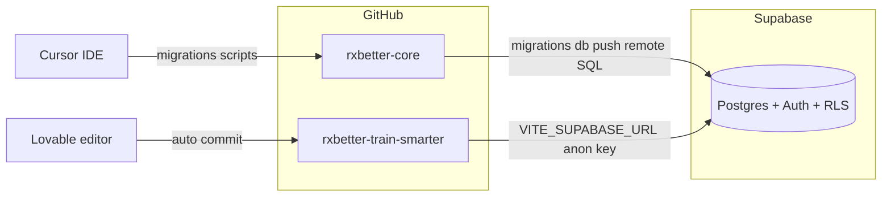

# RxBetter — repository architecture

RxBetter is split across **two GitHub repositories** that share **one Supabase project**. This is intentional: Lovable syncs UI code to its own repo; schema and backend workflows stay in core.

## Repositories

| Repository | Role | URL |
|------------|------|-----|
| **rxbetter-core** | Schema source of truth, migrations, RLS, seed/test data, import scripts, shared TypeScript (`src/lib/`, `src/types/`) | https://github.com/pauljaworski/rxbetter-core |
| **rxbetter-train-smarter** | Lovable UI — runnable Vite/React app, components, pages, Lovable Git sync | https://github.com/pauljaworski/rxbetter-train-smarter |



## What lives where

### rxbetter-core (this repo)

- `supabase/migrations/` — **authoritative** DDL and RLS
- `supabase/seed.sql`, `supabase/test_data.sql` — local demo fixtures
- `supabase/remote/` — idempotent SQL for linked remote (Triad test gym, Paul data imports)
- `scripts/` — spreadsheet → SQL generators (SugarWod, Triad Workout Trends)
- `src/lib/` — auth, identity router, track links, Supabase client helpers (copy or mirror into UI repo as needed)
- `src/types/database.ts` — generated DB types; refresh after migrations

### rxbetter-train-smarter (Lovable UI)

- Full app: `package.json`, Vite, Tailwind, shadcn/ui, pages, hooks
- Lovable pushes commits here when GitHub is connected
- May include its own `supabase/` folder from Lovable onboarding — **do not treat that as schema source of truth** unless diffed against core

## Single Supabase project

Both repos must use the **same** Supabase project (the one linked from this repo’s `supabase link`):

- **Core:** `npx supabase db push --linked`, `npx supabase db query --linked -f supabase/remote/...`
- **Lovable / UI:** Project settings → Supabase → same project URL and anon key (see `.env` / Lovable env)

Schema changes flow **core → Supabase → UI types**, never the reverse without review.

## Recommended workflows

### Schema or RLS change

1. Add migration in `rxbetter-core/supabase/migrations/`.
2. `npx supabase db push --linked` (or local `supabase db reset` for dev).
3. Regenerate or copy `src/types/database.ts` into the Lovable repo.
4. Rebuild UI in Lovable against new columns/policies.

### Triad / Paul test data (remote)

Run in order from `rxbetter-core`:

```bash
npx supabase db query --linked -f supabase/remote/02_paul_auth_dates_prs.sql
npx supabase db query --linked -f supabase/remote/06_paul_staff_roles.sql
npx supabase db query --linked -f supabase/remote/03_spreadsheet_import.sql
npx supabase db query --linked -f supabase/remote/04_triad_workout_trends.sql
```

Regenerate import SQL after spreadsheet changes:

```bash
node scripts/import-paul-spreadsheet-data.mjs
node scripts/import-triad-workout-trends.mjs
```

### UI feature (Lovable)

1. Design and prompt in Lovable → commits to `rxbetter-train-smarter`.
2. Clone UI repo locally for deeper edits or PR review.
3. If UI needs new tables/columns, implement migration in **core** first, then update UI.

### Shared library code

`src/lib/identity-router.ts`, `auth.ts`, etc. in core are the reference implementation. When Lovable generates overlapping logic, prefer **merging toward core’s behavior** (personas, RLS, hybrid completion: class results in `athlete_performance`, sets in `programming_line_item`).

## Why not one repo?

Lovable’s GitHub integration creates a **dedicated repository** per Lovable project. `rxbetter-core` is not a standard Lovable app root (no Vite `package.json` at repo root). Merging UI into core is possible as a monorepo later but breaks Lovable’s automatic sync unless the project is re-linked.

## Personas and data model

- **Personas:** athlete, coach, programmer, admin — via `fitness_membership.role` + matching `athlete_subscription.subscription_scope` (`athlete_track`, `staff_coach`, `staff_programmer`, `staff_admin`). See [`MEMBERSHIP_OFFERINGS_VERIFICATION.md`](MEMBERSHIP_OFFERINGS_VERIFICATION.md).
- **Tables:** [`SUPABASE_DATA_MODEL.md`](SUPABASE_DATA_MODEL.md)
- **AI / product rules:** [`../RXBETTER_SYSTEM_INSTRUCTIONS.md`](../RXBETTER_SYSTEM_INSTRUCTIONS.md)

## Related documentation

| Doc | Location |
|-----|----------|
| Table purposes | [`SUPABASE_DATA_MODEL.md`](SUPABASE_DATA_MODEL.md) |
| Membership / Triad smoke tests | [`MEMBERSHIP_OFFERINGS_VERIFICATION.md`](MEMBERSHIP_OFFERINGS_VERIFICATION.md) |
| Docs index | [`README.md`](README.md) |
| Root README | [`../README.md`](../README.md) |
| Lovable UI repo | https://github.com/pauljaworski/rxbetter-train-smarter |
