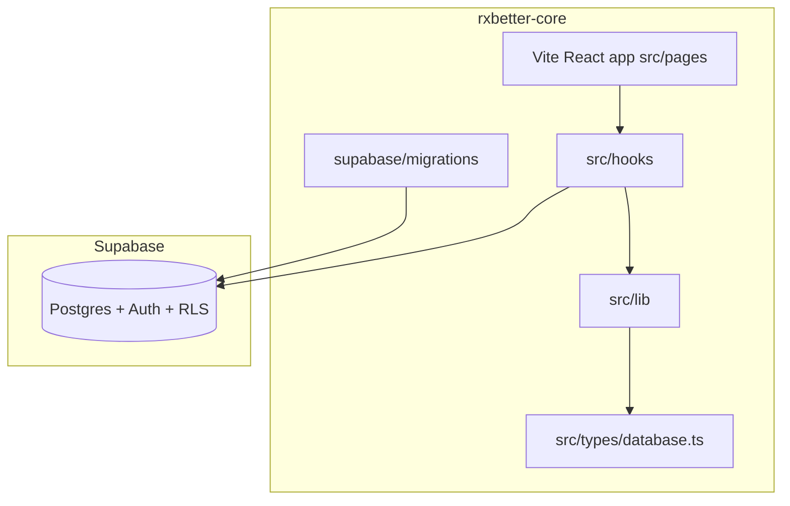

# RxBetter — repository architecture

## Monorepo (current)

**`rxbetter-core`** is the single development repository:

- **Backend:** `supabase/migrations/`, `supabase/remote/`, `scripts/`
- **Frontend:** Vite + React + Tailwind + shadcn under `src/` (`npm run dev` at repo root)
- **Shared types:** `src/types/database.ts` (regenerate after migrations)

The historical Lovable repo [rxbetter-train-smarter](https://github.com/pauljaworski/rxbetter-train-smarter) is **archived** for Git sync history; active UI work happens in **this repo**.



## Supabase client

- Canonical client: [`src/lib/supabase.ts`](../src/lib/supabase.ts)
- App import path: `@/integrations/supabase/client` (re-export only)
- Env: `VITE_SUPABASE_URL`, `VITE_SUPABASE_ANON_KEY` (or legacy `VITE_SUPABASE_PUBLISHABLE_KEY`)

Do **not** add Lovable-only migrations under `supabase/` from other repos.

## Layer conventions

| Layer | Location |
|-------|----------|
| Pages (routes) | `src/pages/` |
| Data hooks | `src/hooks/` |
| Feature UI | `src/components/workout/`, `coach/`, `rx/`, `layout/` |
| shadcn primitives | `src/components/ui/` |
| Reference libs | `src/lib/` |

## Hybrid completion (class WOD)

| Layer | Table | Athlete UI |
|-------|-------|------------|
| Session | `programming` | Read-only |
| Prescription | `programming_line_item` (shared) | Read-only |
| Result | `athlete_performance` | Insert/update/delete |

See [`SUPABASE_DATA_MODEL.md`](SUPABASE_DATA_MODEL.md).

## Identity & personas

- `AuthContext`: gym switcher, `mode` = `personal` | `gym`, additive roles (athlete, coach, programmer, admin)
- Reference: [`src/lib/identity-router.ts`](../src/lib/identity-router.ts)
- Track links: [`src/lib/track-links.ts`](../src/lib/track-links.ts) + `/join/:linkId`

## Remote test data (Triad / Paul)

```bash
npx supabase db query --linked -f supabase/remote/02_paul_auth_dates_prs.sql
npx supabase db query --linked -f supabase/remote/06_paul_staff_roles.sql
npx supabase db query --linked -f supabase/remote/03_spreadsheet_import.sql
npx supabase db query --linked -f supabase/remote/04_triad_workout_trends.sql
```

## Related documentation

| Doc | Location |
|-----|----------|
| Table purposes | [`SUPABASE_DATA_MODEL.md`](SUPABASE_DATA_MODEL.md) |
| Membership verification | [`MEMBERSHIP_OFFERINGS_VERIFICATION.md`](MEMBERSHIP_OFFERINGS_VERIFICATION.md) |
| Docs index | [`README.md`](README.md) |
| Root README | [`../README.md`](../README.md) |
